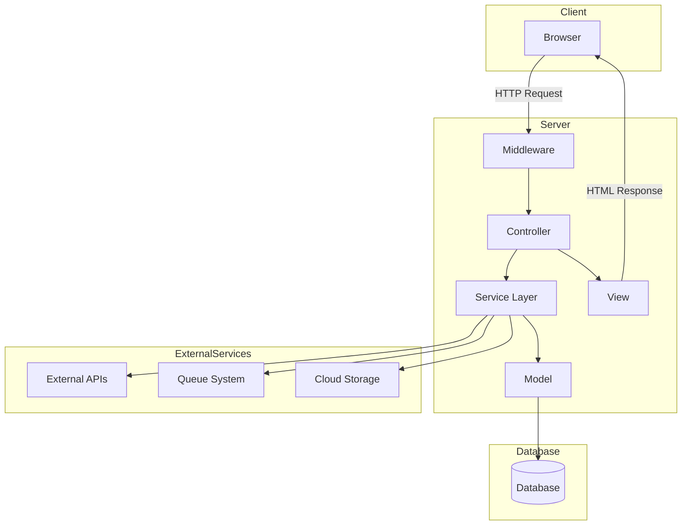

# Adamana Server (2025) - Todos

## Phase 1: Core Setup & Map Display

*   [/] **Project Initialization**:
    *   [x] Initialize Laravel project (`adamana-server-2025`) with Inertia / React.
    *   [x] Configure database (MySQL).
    *   [/] Migrate reusable script from old Laravel project (`adamana-server`)

*   [/] **Device Simulator deveopment**:
    *   [/] Build Node.js device simulator for API testing
    *   [ ] Integrate automated location update, based on lists of coordinate input (csv)

*   [/] **Dashboard Development**:
    *   [/] Add Google Maps
    *   [ ] Add device list overlaying the map
    *   [ ] Add Device Management page
    *   [ ] Add Administrator page
    *   [ ] Add User Access Level management (Sanctum/Passport)

## Architecture Diagram

---
**Key for Status:**
*   [ ] - To Do
*   [/] - In Progress
*   [x] - Completed
*   [-] - Cancelled/Postponed
